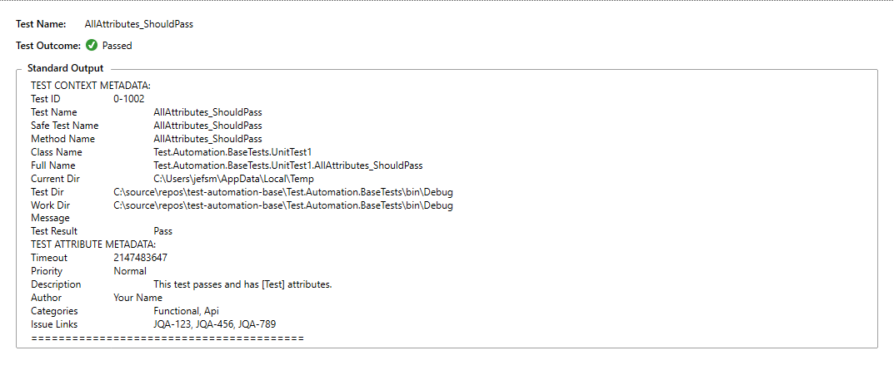
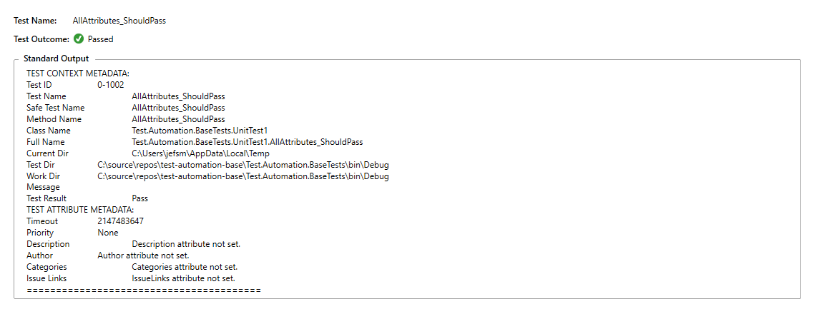

# Test.Automation.Base

**README.md**

Automatically logs test attribute and test context data to the output window.  
 - In general, logging can add a significant performance penalty to a passing test.
 - This framework only logs when tests fail or are run in debug mode.

## Release Notes
|Date|Description|
|---|---|
| 2020-05-25| Refactor Categories, IssueLinks<br>Remove JSON dependency|
|2018-08-25|Bug fixes; refactoring|
|2018-07-01|Bug fixes <br> Update README|
|2018-02-18|Bug fixes|
|2017-12-05|Initial Release|

## Contents
[NUnit Test Project Workflow](#nunit-test-project-workflow)  
[Viewing Local Packages](#viewing-local-packages)  
[Octopack Reference](#octopack-reference)  
[Troubleshooting](#troubleshooting)  

## NUnit Test Project Workflow
- Ensure your test class inherits from the base class **`TestAutomationBase`**
- Ensure you have installed NUnit and NUnit3TestAdapter NuGet packages.
- If the test is run in debug mode or if the test fails, the output window displays the test log.
- If the test passes and is not run in debug mode, nothing is logged to the output window.

### Example Tests

```csharp
using NUnit.Framework;
using Test.Automation.Base;

namespace Test.Automation.BaseTests
{
    [TestFixture]
    public class UnitTest1 : TestAutomationBase
    {
        [Test,
            Timeout(60000),
            Priority(Priority.High),
            Description("This test fails and has [Test] attributes."),
            Author("Your Name"),
            Categories(TestLevel.Component, TestType.Functional, TestArea.None),
            IssueLinks("jra-123", "jra-456", "jra-789"),
            Property("Bug", "FOO-42"), 
            Property("Bug", "FOO-43"), 
            Property("ID", "BAR-42")]
        public void AllAttributes_ShouldFail()
        {
            Assert.That(21 + 21, Is.EqualTo(41));
        }

        [Test(
            Author = "Your Name",
            Description = "This test passes and has [Test] attributes.",
            TestOf = typeof(int)),
            Priority(Priority.Normal),
            Categories(TestLevel.None, TestType.Functional, TestArea.Api),
            IssueLinks("jqa-123", "JQA-456", "jQa-789"),
            Property("ID", "BAR-42"),
            Property("Value", "100")]
        public void AllAttributes_ShouldPass()
        {
            Assert.That(21 + 21, Is.EqualTo(42));
        }

        [TestCase(2, 3, Author = "Your Name", Category = "Integration, Smoke, Web", Description = "This test fails and has [TestCase] attributes.", TestName = "ParameterizedTestCase_ShouldFail")]
        [TestCase(-5, 9)]
        public void ParameterizedTestCase(int first, int second)
        {
            Assert.That(first + second, Is.EqualTo(4));
        }
    }
}
```
  
### Example Test Output

  
  

## Viewing Local Packages
- Install NuGet Package Explorer to view local packages.  
- [NuGetPackageExplorer](https://github.com/NuGetPackageExplorer/NuGetPackageExplorer)

## Octopack Reference
#### Create a Local NuGet Package with OctoPack
- Add a `.nuspec` file to each project in the solution that you want to package with NuGet.
- The `.nuspec` file name **must be the same name as the project** with the `.nuspec` extension
- Open a '`Developer Command Prompt for VS2019`' command window.
- Navigate to the solution or project that you want to OctoPack.
- Be sure to increment the build version after making and saving changes to force a new build.

Run the following command:  
```text
MSBUILD Test.Automation.Base.csproj /t:Rebuild /p:Configuration=Release /p:RunOctoPack=true /p:OctoPackPublishPackageToFileShare=C:\Packages /p:OctoPackPackageVersion=1.0.0
```
 
##### MSBUILD OctoPack Command Syntax
|Switch|Value|Definition|
|-----|-----|-----|
|`/t:Rebuild`|  |MSBUILD Rebuilds the project(s).|
|`/p:Configuration=`|`Release`|Creates and packages a Release build.|
|`/p:RunOctoPack=`|`true`|Creates packages with Octopack using the .nuspec file layout.|
|`/p:OctoPackPackageVersion=`|`1.0.0`|Updates Package Version.|
|`/p:OctoPackPublishPackageToFileShare=`|`C:\Packages`|Copies packages to local file location.|
    
##### Other OctoPack Options:

|Switch|Value|Description|
|-----|-----|-----|
|`/p:Configuration=`|`[ Release | Debug ]`|The build configuration|
|`/p:RunOctoPack=`|`[ true | false ]`|Enable or Disable OctoPack|
|`/p:OctoPackPackageVersion=`|`1.2.3`|Version number of the NuGet package. By default, OctoPack gets the version from your assembly version attributes. Set this parameter to use an explicit version number.|
|`/p:OctoPackPublishPackageToFileShare=`|`C:\Packages`|Copies packages to the specified directory.|
|`/p:OctoPackPublishPackageToHttp=`|`http://my-nuget-server/api/v2/package`| Pushes the package to the NuGet server|
|`/p:OctoPackPublishApiKey=`|`ABCDEFGMYAPIKEY`|API key to use when publishing|
|`/p:OctoPackNuGetArguments=`| `-Verbosity detailed`|Use this parameter to specify additional command line parameters that will be passed to NuGet.exe pack.|
|`/p:OctoPackNuGetExePath=`|`C:\MyNuGetPath\`|OctoPack comes with a bundled version of NuGet.exe. Use this parameter to force OctoPack to use a different NuGet.exe instead.|
|`/p:OctoPackNuSpecFileName=`|`<C#/VB_ProjectName>.nuspec`|The NuSpec file to use.|

## Troubleshooting
TBD
